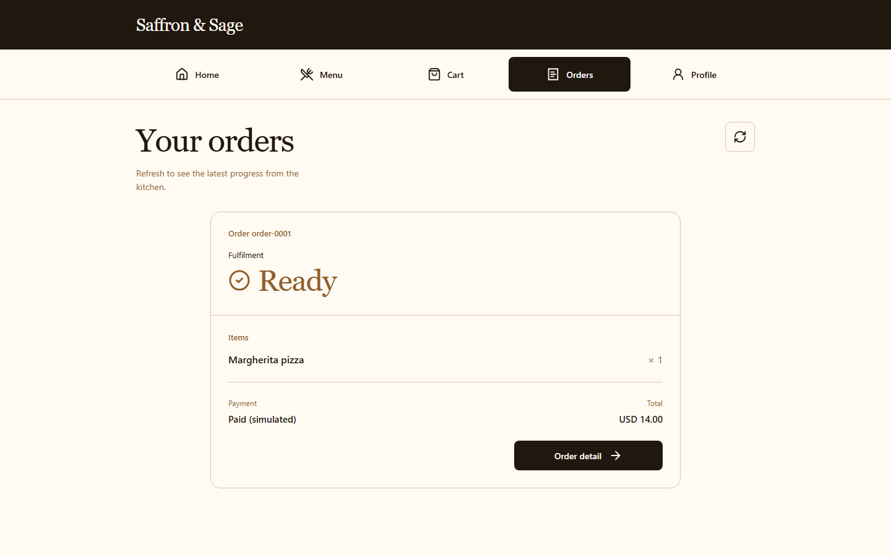
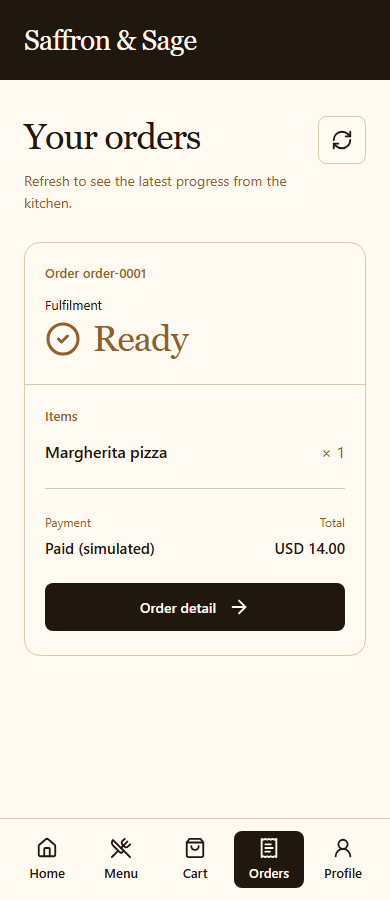

<div align="center">

# Archeform · 元象

**Turn a business need into a working application.**

An open-source Application Graph platform for generating applications with
coherent screens, data, permissions, workflows, and verifiable behavior.

[Try locally](#try-locally) · [Applications](#supported-applications) ·
[Architecture](#how-it-works) · [Production roadmap](#path-to-production) ·
[Contribute](#contributing)

</div>

Archeform is being built for people who need software to get a job done:
collect requests, review submissions, coordinate tasks, or take orders.
Describe the outcome, answer necessary business questions, and use the result.
The platform's job is to assemble and verify the application; understanding
frameworks, schemas, and compilation should not be a prerequisite for users.

**Status: local Alpha.** Five reviewed product definitions across three runtime
families have bounded local acceptance evidence.
Managed hosting, production identity, and ordinary-user success at scale remain
open work. See [delivery status](docs/project-status.md) for evidence and limitations.

## See the result



The Restaurant app from the earlier D1.8 local acceptance run: a customer has
placed an order and can follow its fulfilment status. This is an actual
generated application with sample data and simulated payment.
[Read the Restaurant delivery evidence](docs/superpowers/ledgers/2026-09-07-consumer-generation-delivery.md).

<details>
<summary>View the same Restaurant app on mobile</summary>



</details>

## Supported applications

These are reviewed business definitions with executable local journeys.
Support is bounded by each definition's declared fields, roles, and rules.

| Application               | Demonstrated local journey                                                                  | Evidence                                                                         |
| ------------------------- | ------------------------------------------------------------------------------------------- | -------------------------------------------------------------------------------- |
| Restaurant Ordering       | Customer menu, cart, checkout, orders, and merchant workflow; simulated payment             | [Restaurant acceptance](docs/acceptance/post-v0.1-local-restaurant-readiness.md) |
| Expense Approval          | Submit, review, return with a reason, revise the same request, and resubmit                 | [Approval correction](docs/acceptance/approval-correction.md)                    |
| Purchase Request Approval | Purchase requests with retained decisions, correction, and safe retries                     | [Approval correction](docs/acceptance/approval-correction.md)                    |
| Team Task Tracking        | Create, start, complete, reopen, and correct a task; handle stale writes and denied actions | [Task correction](docs/acceptance/task-correction.md)                            |
| Publication Review        | Submit an article for editorial review; distinguish submissions and retain history          | [Definition batch](docs/acceptance/definition-batch-one.md)                      |

The current families are Ordering, Approval, and Team Task. A catalogue entry,
a visual variant, and an independently verified business application are
different measures. Appointment scheduling, inventory, real payments, and
hundreds of definitions remain future scope.

## Why Archeform?

- **Complete business journeys.** Screens connect to persistent data, role
  checks, and workflow transitions. Acceptance exercises the actual generated
  app, including correction and failure paths.
- **A durable application definition.** The versioned Application Graph retains
  pages, domain semantics, policies, and workflows. Generated source is a
  compilation artifact; the Graph remains the source of truth.
- **Reusable product knowledge.** Reviewed definitions compose established
  business families, UI recipes, and licensed materials. Supported definitions
  reuse execution and presentation without a separate handwritten app.
- **Controlled change.** Drafts are reviewable. Publish creates an immutable
  revision, and compilation consumes that revision only. Historical artifacts
  stay traceable while new revisions evolve.
- **Verification beyond compilation.** Local acceptance covers runtime startup,
  persistence, business journeys, authorization denial, interrupted actions,
  responsive behavior, and cleanup within the tested scope.

The Workbench provides creation, preview, and advanced inspection. Visual
editors and AI providers are adapters around the Graph. Advanced editing and
inspection remain available; the product goal is a short path to a useful result.

## Try locally

The supported trial is a **local developer/evaluator setup**, with an automated
Restaurant journey. A hosted signup experience is still planned.

### Prerequisites

- Git and Node.js `>=22.11.0 <23`; `.node-version` selects `22.11.0`.
- pnpm `9.0.0`, as pinned in `package.json`.
- A running Docker engine with Docker Compose `>=2.24.4` for runtime acceptance.
  The worker uses host networking and Docker socket access; the environment
  must support the repository's local profile.

### Install and configure

```powershell
git clone https://github.com/ZP151/archeform.git
cd archeform
corepack enable
corepack prepare pnpm@9.0.0 --activate
pnpm install --frozen-lockfile
if (-not (Test-Path .env)) { Copy-Item .env.example .env }
```

These commands use PowerShell. On a POSIX shell, replace the final line with
`test -f .env || cp .env.example .env`.

Set unique local values for `FACTORY_REDIS_PASSWORD` and
`FACTORY_INTERNAL_WORKER_TOKEN` in the ignored `.env` file. Keep credentials
there; do not paste them into issues, screenshots, or committed files.

Template acceptance requires no AI API key. Free-text model interpretation
requires the configured provider credential; provider-free fixture tests do
not establish real-model accuracy. Keep sensitive business data out of trial inputs.

### Run the supported acceptance journey

```powershell
pnpm run doctor
pnpm build
pnpm accept:local
```

The runner starts a run-owned local stack, opens the shipped Restaurant
template, edits a Draft, publishes and compiles it, verifies the generated app,
exercises ordering, checks accessibility, and tears down its own previews,
containers, networks, and volumes. Its bounded summary reports step outcomes;
a passing run requires zero accessibility violations and zero remaining owned resources.

Read the [local acceptance guide](docs/acceptance/post-v0.1-local-restaurant-readiness.md)
for the exact scope and recorded supported-environment result. This README
update does not claim a new runtime acceptance run.

For interactive development, `pnpm dev` starts workspace development processes
and assumes the required infrastructure and configuration are available.
`pnpm compose:up` builds and starts the full local Compose stack, including the
Workbench on port `5174` by default. Its published ports and privileged worker
are developer infrastructure, not an approved production deployment profile.
`pnpm compose:down` **deletes the stack's volumes**, including local data.
Use the run-owned acceptance flow above for a disposable trial.

## How it works

The intended user experience is:

```text
Describe a need → Clarify business details if necessary → Use the application
```

Internally, the platform preserves explicit boundaries:

```text
Requirement + reviewed product definition
                    ↓
       Validated proposal → Draft Graph
                    ↓ Publish
         Immutable Published Revision
                    ↓ Compile
          Immutable Compilation
                    ↓
       Isolated verification → Local Preview
```

Compilers never consume mutable Drafts. Verification can diagnose a failure and
propose a reviewable Draft change; it does not patch immutable Published
revisions or completed Compilations. Product Publish, Git integration,
repository release, and cloud deployment are separate operations.

The current stack uses TypeScript, Next.js/React, NestJS, Prisma/PostgreSQL,
and BullMQ/Redis. See the [architecture](docs/architecture/application-graph-platform.md)
and [technology decisions](docs/tech-governance.md) for supported contracts.

| Area                    | Responsibility                                                  |
| ----------------------- | --------------------------------------------------------------- |
| `apps/workbench`        | Creation, visual editing, preview, and inspection               |
| `apps/control-plane`    | Graph API, revision lifecycle, and orchestration                |
| `apps/compiler-worker`  | Compilation, verification, and local preview work               |
| `packages/graph`        | Versioned Graph schemas and semantic validation                 |
| `packages/adapters`     | Reviewed definitions, AI interpretation, and external adapters  |
| `packages/compiler`     | Deterministic targets and generated-project templates           |
| `packages/capabilities` | Reusable business semantics and composition                     |
| UI and recipe packages  | Shared primitives, patterns, screens, experiences, and products |

Stable `@factory/*` package names and `factory.application-graph/*` identifiers
remain part of the implementation. The public product name is Archeform.

## Path to production

The direction is a responsive application that an ordinary user can create and
share with minimal effort. Production readiness requires evidence across these
outcomes; an updated README does not establish it.

| Area                   | Established locally                                                        | Required next evidence                                                                                                              |
| ---------------------- | -------------------------------------------------------------------------- | ----------------------------------------------------------------------------------------------------------------------------------- |
| Business correctness   | Five accepted definitions and three runtime families                       | Broader rules and edge cases; resolve long application-ID database naming before scale                                              |
| Reuse and coverage     | Strict data catalogue, batch validation, shared execution and presentation | Distinct accepted jobs across 30 definitions before 100+; numeric rules, calculated totals, scheduling, and other missing semantics |
| Ease of use            | Bounded automated generation and authored local journeys                   | Real-model selection and ordinary-user sessions measuring success, questions, time to useful action, and manual intervention        |
| Identity and security  | Tested demo roles, state denial, and bounded runtime controls              | Production identity, tenant isolation, key management, audit retention, rate limits, and incident response                          |
| Hosting and operations | Local verification and Preview with cleanup evidence                       | Approved hosting and runner isolation, durable delivery, stable URLs, recovery, and operating ownership                             |
| Release reliability    | Profile-specific acceptance and immutable output checks                    | Passing integration gates on each merged commit; traceable fixes for baseline failures                                              |

The [scale roadmap](docs/superpowers/plans/2026-09-13-product-definition-scale.md)
prioritizes useful semantic coverage and ordinary-user effort over template
counts. The [threat model](docs/threat-model.md) blocks external multi-tenant
production use while identity and operational risks remain unresolved.
Hosting and security changes follow [technology governance](docs/tech-governance.md).

## Development and verification

```powershell
# Short provider-free tooling checks
node scripts/regression.mjs smoke

# Selected product suites, with prerequisite builds
node scripts/regression.mjs product

# Repository checks
pnpm --filter @factory/control-plane prisma:generate
pnpm format:check
pnpm typecheck
pnpm test
pnpm build
pnpm verify:third-party
pnpm verify:source-studies
```

These commands describe available checks, not a claim that the branch passes
all of them. Selected product tests exclude some packages and do not replace
full repository checks or browser acceptance.
See [regression scope](docs/testing/consumer-regression.md).
`pnpm test:e2e` requires the relevant browser/runtime configuration and fixtures;
use the acceptance guide for the supported end-to-end trial.

## Contributing

Start with a concrete user job and its missing behavior. Reuse an approved
capability or UI recipe, add focused behavior tests, and record applicable
runtime evidence. Definitions need distinct business semantics, declared
limitations, and executable journeys.

- [Author a reviewed definition](docs/product-definition-authoring.md).
- [Check generated-product acceptance](docs/acceptance/consumer-product-checklist.md).
- Follow [repository rules](AGENTS.md), [technology governance](docs/tech-governance.md),
  and [delivery policy](docs/delivery-policy.md).
- [Report a reproducible issue](https://github.com/ZP151/archeform/issues) with
  the commit, environment, expected result, and safe reproduction steps.
  Exclude credentials, private business data, and raw model input/output.

## Related projects

[Appsmith](https://github.com/appsmithorg/appsmith),
[ToolJet](https://github.com/ToolJet/ToolJet),
[Dyad](https://github.com/dyad-sh/dyad), and
[Amplication](https://github.com/amplication/amplication) are useful references
for application-building workflows and developer onboarding. This README
borrows organizational lessons from their public documentation; it makes no
compatibility or endorsement claim.
[Reference notes](docs/research/2026-09-15-readme-and-main-assessment.md).

## License

[MIT](LICENSE). Third-party packages and admitted assets retain their own
licenses and notices; see [third-party notices](THIRD_PARTY_NOTICES.md).
